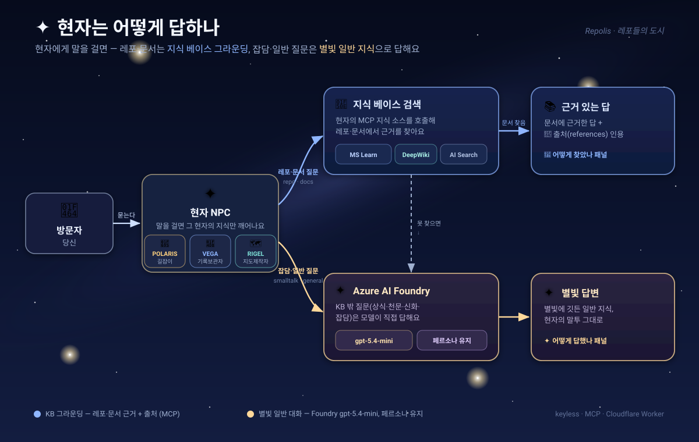
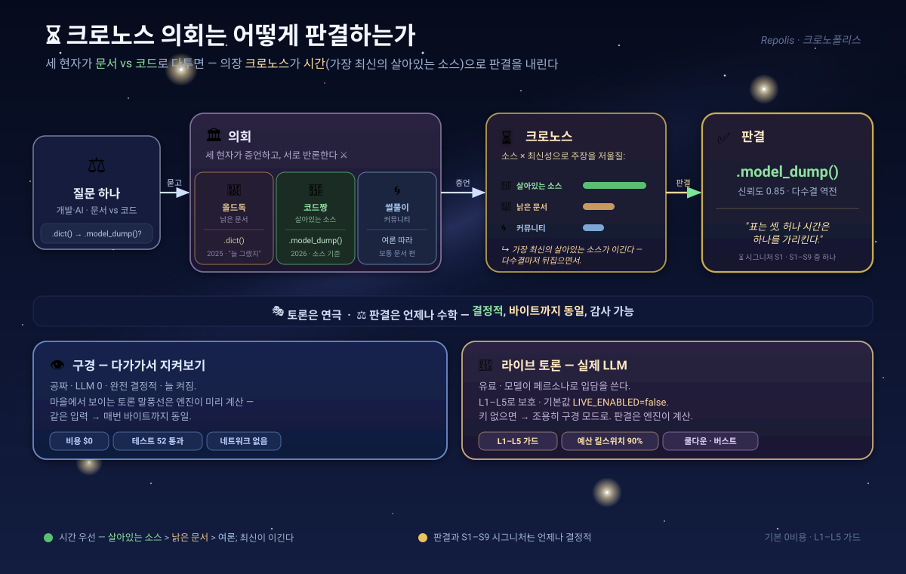
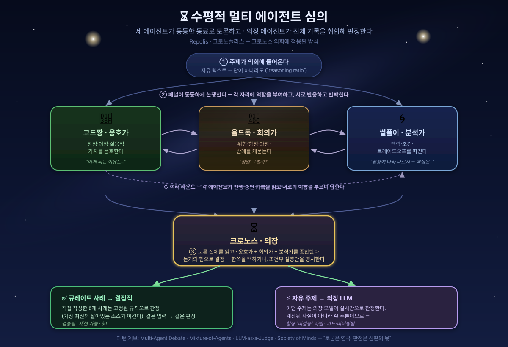

<div align="center">

<a href="https://hyeonsangjeon.github.io/Repolis/"></a>

# 🏙️ Repolis — 레포들의 도시

**내 GitHub은 핀 6개짜리 격자가 아니라, 걸어다니는 3D 도시 — 택시기사에게 말만 하면 원하는 레포까지 태워다 줍니다.**

[](https://hyeonsangjeon.github.io/Repolis/)
[](https://hyeonsangjeon.github.io/Repolis/)
[](https://threejs.org)
[](index.html)
[](https://github.com/hyeonsangjeon/Repolis/commits)
[](https://github.com/hyeonsangjeon/Repolis/stargazers)
[](LICENSE)

[English](README.md) · [한국어](README.ko.md)

**내 GitHub 레포는 목록이 아니라 걸어다니는 도시예요.** 집 하나하나가 레포이고, 높이·밝기·화려함·마당은 ⭐가 아니라 **실제 트래픽**(방문자·클론·포크·조회수)으로 자라요.
어디로 갈지 모르겠다면? 🚕 **LLM 택시기사**에게 말만 하세요 — _"제일 인기있는 레포로 데려다줘"_ 하면 택시가 **내 옆까지 와서 태우고** 그 레포의 집까지 곧장 데려다줍니다.

<a href="https://hyeonsangjeon.github.io/Repolis/"></a>

<sub>▶ <a href="https://hyeonsangjeon.github.io/Repolis/"><b>라이브 데모</b></a> · Built with Three.js · 한 개의 <code>index.html</code></sub>

</div>

---

## ✨ 무엇이 들어있나

- 🚶 **걸어다니는 오픈월드** — WASD/방향키/조이스틱으로 직접 디자인한 로우폴리 도시를 산책. **이제 건물은 단단해서** 통과하지 않고 *돌아서* 다녀요 — 갈색 흙길과 차선을 그린 아스팔트 링도로를 따라. 집(레포)에 도착하면 카드가 열려요(설정돼 있으면 GitHub **소셜 프리뷰** 이미지까지).
- 🏙️ **도심지 & 홈타운 구역** — 종합 인기 상위 레포는 안쪽 도심지의 타워로, 나머지는 외곽 홈타운의 아늑한 코티지로. 링 도로와 방사형 대로로 이어져요.
- 📊 **지표가 곧 건축** — 데이터가 도시를 짓습니다:
  | 지표 | 건물에 반영 |
  |---|---|
  | 👁 방문자(unique visitors) | 건물 **높이** |
  | ⑂ forks | 건물 **너비**(터 크기) |
  | ⬇ clones | **화려함**(깃발·금장식) |
  | 📈 views | **마당**·울타리 크기 |
  | ★ stars | 지붕 위 **금별** 장식 |
  | 🌙 활동량 _(최근 push · clone · view)_ | **밤의 창문 밝기** |
- 🗓️ **분양일부터 누적** — 방문자·클론은 그 집이 "지어진 날"(데이터에 처음 잡힌 날)부터의 **누적 합계**예요. 카드에 _"since YYYY‑MM‑DD"_ 분양일과 함께 **실시간 GitHub 배지**(라이선스 · 열린 이슈 · 최신 릴리스 태그)가 있으면 같이 표시됩니다.
- 🚕 **진짜로 태워주는 LLM 택시기사** — 자연어로 물어보면 가장 맞는 레포를 골라 설명하고, 택시가 **내 자리로 와서 → 탑승 → 그 집까지 데려다줘요.** 3가지 모드:
  - **로컬검색** (기본·키 불필요·즉시) — 동의어 확장 인텐트 검색. _"제일 많이 클론된"_, _"방문자 최다"_, _"포크 많은"_ 같은 **지표 기반 검색**도 되고, 확실한 주제 매칭은 일반 지표 정렬보다 항상 우선하며, 고를 수 있는 **대안 추천 몇 개**가 늘 함께 떠요.
  - **WebLLM** (브라우저 내장 AI·키 불필요·WebGPU)
  - **🛰️ AI Foundry Live** (선택·grounded) — 내 레포에 대한 라이브 질문을 Azure AI Search 지식 베이스 + GitHub 호스티드 MCP로 처리. 백엔드가 없으면 **자동으로 로컬검색으로 폴백**해서 키 없이도 동작해요.
- 📘 **말 걸 수 있는, 이름을 가진 현자들** — 택시기사 말고도, 광장의 NPC들은 **이름을 가진 밤하늘의 별**이에요. 각자 **하나의 라이브 MCP 지식소스**에 연결된 **POLARIS · 길잡이**(택시기사), **VEGA · 기록보관자**(**MS Docs 엔지니어**), 그리고 **RIGEL · 지도제작자**예요. VEGA에게 다가가 Azure · .NET · Copilot을 물어보면, Azure AI Search **Foundry MCP 지식 소스**로 **Microsoft Learn 공식 문서를 실시간 검색**하고 `gpt-5.4-mini`가 **여러분의 언어로** 답을 정리해 문서 링크 trace까지 보여줘요. **RIGEL**에게 다가가 공개 레포 이름(`facebook/react`, `langchain-ai/langchain`)을 대면, *아리아드네*의 혼으로 **키 없는 DeepWiki MCP**를 통해 코드의 미궁에 실을 풀어 그 레포의 내부 구조를 지도처럼 그려줘요. 각 현자는 **자기가 누구인지도 알아서** — _"너 누구야?"_, _"여긴 어디야?"_, _"다른 현자는 누가 있어?"_라고 물으면 **자기 신화·이 도시·주인**을 담아 (지식소스 호출 없이) 바로 답해요. 채팅은 **멀티턴 맥락**을 기억하고, 모든 현자는 **[`SCHOLARS.md`](SCHOLARS.md)**에 등록돼 있어요 — 스크립트 한 번으로 새 현자를 추가할 수 있죠. 그리고 **택시기사 POLARIS를 포함한 모든 현자**는 그냥 **수다**도 떨 수 있어요: 주제 밖이나 잡담을 건네면 **별빛에 깃든 일반 지식**으로 **자기 말투 그대로**(Azure AI Foundry `gpt-5.4-mini`) 답해줘요. 레포를 들이밀지 않고, ✦ _어떻게 답했나_ 패널과 함께요.
- 🏡 **단순히 높아지는 게 아니라, 6단계 집 등급** — 트래픽 순위에 따라 `오두막 → 코티지 → 주택 → 빌라 → 저택 → 포르티코 맨션`으로 지어지고, 부속동·기둥·포르티코·다락창·발코니·큐폴라가 붙어요. 인기 레포는 웅장한 기둥 저택, 조용한 레포는 아담한 오두막.
- 🌳 **살아있는 도시** — **절차적으로 텍스처링된 집**(벽돌 · 사이딩 · 석재 · 슁글 지붕 — *이미지 에셋 0개*), 정원, **콜마르풍 꽃 마을**(마을 곳곳을 가로지르는 쁘띠 베니스 운하 · 장미 아치 · 꽃수레 · 마켓 가판), **3가지 색(아이보리·갈색·검정) 차우차우 펫**, 가로수, 가로등, **앉았다 일어설 수 있는 쉼터 정자**, 그리고 가장 활발한 레포를 위한 **koi 연못과 차고**까지. 지붕 위 카테고리 로고(AI / Data / Software …)와 타운하우스 도로도 그대로.
- 🌙 **낮과 밤, 그리고 살아있는 창문** — HUD의 🌙 / ☀️ 스위치를 눌러요. 밤이 되면 하늘이 남색으로 물들고 가로등·별이 켜지며, **각 레포의 창문이 활동량(최근 push · clone · view)만큼 밝게 빛나요** — 그래서 가장 바쁜 레포가 스카이라인을 밝힙니다. 머리 위로는 각 현자의 **신화 별자리**(POLARIS는 작은곰자리, VEGA는 거문고자리, RIGEL은 오리온자리)가 밤하늘 돔에서 반짝이고, 광장엔 빛나는 **룬 서클과 떠다니는 별먼지**가 깔려요.
- 🟢 **실시간 멀티플레이어** — 다른 방문자가 이름표 달린 아바타로 함께 걸어다니고, HUD에 **현재 접속자 · 오늘 · 누적 순방문자 카운터**(🟢 N · 오늘 M · 누적 K)가 떠요. **데모에는 이미 켜져 있고**, fork 하면 무료 서버 하나를 연결하기 전까진 솔로가 기본이에요(아래).
- 🌐 **영어 / 한국어 전환** — HUD에서 UI 언어를 실시간으로 바꿔요.

> 💬 **택시에게 이렇게 물어보세요:** _"제일 인기있는 레포"_ · _"AI 에이전트 관련"_ · _"제일 많이 클론된"_ · _"한국어 STT 프로젝트"_ · _"아무거나"_ — 가장 맞는 레포를 골라 이유를 설명하고, 그 집까지 데려다줘요.

## 🧠 어떻게 동작하나 (데이터 흐름)

```
github-traffic-monitor (private)        Repolis (public)
  └ 매일 트래픽 누적(logs/*.csv) ──┐
                                    ├─▶ .github/workflows/refresh.yml (매일)
  gh api: 내 공개 레포 (+ 커밋한 fork) ─┘  └ scripts/build_repos.py
                                               └─▶ repos.json  ──▶  index.html (Three.js 3D 도시)
```

- **내 공개 레포**를 포함합니다 — 내가 만든 레포 전부에, **내가 실제로 커밋한 fork**까지(손대지 않은 단순 미러 fork는 제외). 비공개 레포 이름은 공개 사이트에 절대 노출되지 않아요.
- 트래픽 합계는 [`github-traffic-monitor`](https://github.com/hyeonsangjeon/github-traffic-monitor)가 모아 온 **누적값**입니다. (GitHub 트래픽 API는 14일치만 보관하므로, 평생 누적치를 만들려면 매일 모으는 수집기가 필요해요.)

### 🌌 현자는 어떻게 답하나 — 그라운딩 vs 별빛 수다



현자에게 말을 걸면 질문이 두 갈래로 나뉘어요. **레포·문서 질문**은 그 현자의 MCP 지식소스(MS Learn · DeepWiki · Azure AI Search)로 **KB 그라운딩**을 돌려 **출처와 함께 근거 있는 답**으로 돌아오고, **주제 밖·잡담 질문**(또는 지식 베이스에서 못 찾았을 때)은 **Azure AI Foundry `gpt-5.4-mini`**가 **자기 말투 그대로** 답해요 — _별빛_ 일반 지식, 레포는 들이밀지 않고요. 모든 답에는 trace 패널(🔎 _어떻게 찾았나_ / ✦ _어떻게 답했나_)이 붙어 어느 길로 답했는지 보여줍니다.

### ⏳ 크로노스 의회의 판결 — 토론은 연극, 판결은 수학



마을 한켠 돔형 로툰다에서 세 토론 현자가 **문서 vs 코드**로 다툽니다 — 📜 **올드독**은 매뉴얼을 인용하고, 🌿 **코드짱**은 돌아가는 소스를 믿고, 🌀 **썰풀이**는 여론을 옮깁니다. 의장 ⏳ **크로노스**가 **소스 × 최신성**으로 주장을 저울질해, 가장 최신의 살아있는 소스인 **시간**에게 판결을 맡깁니다. 입담은 연극이고, 판결은 **언제나 결정적 엔진**이 내립니다(바이트까지 동일, 테스트 52개 통과). **구경**(다가가서 지켜보기)은 공짜·LLM 0이고, **라이브** 토론은 선택형 가드 유료 LLM입니다(기본값 `LIVE_ENABLED=false`, 키 없으면 조용히 폴백).


### 🧠 그 뒤의 패턴 — 수평적 멀티 에이전트 심의

*어떤* 주제든 — `reasoning ratio` 같은 단어 하나라도 — 입력하면 세 **동료** 현자가 SSE로 **라이브 토론**을 벌여요: 🌿 **코드짱**(*옹호가*), 📜 **올드독**(*회의가*), 🌀 **썰풀이**(*분석가*)가 라운드를 거치며 **서로의 이름을 부르며** 반응·반박하고, **사람이 읽는 속도로 페이싱**돼 실제로 따라갈 수 있어요. 그다음 **시간의 의장**이 전체 기록을 읽고 판정합니다. 자유 주제 판정은 **AI 추론**이라 항상 **⚡ 미검증** 배지를 달고 — 큐레이트된 6개 사례는 **결정적** 수학 판정을 유지해요. *멀티 에이전트 토론 → 심판* 패턴의 작고 정직한 한 사례입니다.



**→ 자세히: [`COUNCIL_PATTERN.ko.md`](COUNCIL_PATTERN.ko.md)** — 개념도, 역할, 골든 룰(검증됨 vs 미검증), 그리고 패턴의 계보(Multi‑Agent Debate · Mixture‑of‑Agents · LLM‑as‑a‑Judge · Society of Mind).


## 🚀 직접 띄우기

1. **이 레포를 Fork/사용**하고, 트래픽 데이터 소스가 필요해요. [`github-traffic-monitor`](https://github.com/hyeonsangjeon/github-traffic-monitor) 같은 일일 트래픽 수집 레포를 두세요.
2. **Secret 추가** — `Settings → Secrets and variables → Actions`:
   - `GH_PAT` : `repo` 스코프 Personal Access Token (비공개 traffic-monitor 체크아웃 + 레포 목록 조회용)
3. **GitHub Pages 켜기** — `Settings → Pages → Source: Deploy from a branch → main / (root)`.
4. **Action 실행** — `Actions → Refresh Repolis data → Run workflow` (이후 매일 자동 갱신).
5. 끝! `https://<당신>.github.io/Repolis/` 에서 도시가 열립니다.

### 로컬에서 바로 띄우기 (빌드 없음)

정적 파일 하나예요 — 클론해서 서빙만 하면 됩니다:

```bash
git clone https://github.com/hyeonsangjeon/Repolis && cd Repolis
python3 -m http.server 8000      # 또는: npx serve .
# http://localhost:8000 열기
```

**내** 레포로 도시를 다시 짓기 (GitHub CLI 로그인 필요):

```bash
gh auth login
GTM_DIR=data python3 scripts/build_repos.py   # repos.json 재생성
```

### 🚕 AI 택시기사 — 모드 · 의도 라우팅 · 인덱싱

택시기사는 자유 문장 질문을 작은 **검색 파이프라인**으로 알맞은 집에 연결해요. 그래서 브라우저 안 작은 모델로도 정확합니다:

```
질문
  └▶ ① 의도 에이전트(결정적) ── "도서관 / library", "제일 인기", "스타 많은",
  │      랜드마크·지표 라우팅      "최근", "클론·포크·조회 많은", "랜덤"
  │      → LLM 없이 바로 응답      → 정확, 환각 0
  └▶ ② 검색 인덱스(역색인) ──── tokens(이름·라벨·언어·설명·토픽) + 동의어,
  │      후보 검색                 최초 1회 lazy 빌드 → 상위 K개 후보
  └▶ ③ 랭킹 ─────────────────── 이름매칭 ≫ 토큰매칭 ≫ 부분문자열, +토픽, +인기,
  │                              그리고 *사용자가 친 단어*가 레포 이름에 있으면 우선
  └▶ ④ LLM이 후보 중 선택(RAG) ─ WebLLM/프록시는 후보 안에서만 골라 "PICK: <repo>"
  └▶ ⑤ 복수 추천 ───────────── 나머지 후보는 한 번에 고를 수 있는 칩으로 표시
```

왜 중요하냐면: *"도서관 데려다줘"* 는 레포 검색이 아니라 **이동(네비)** 의도예요 — ①단계가 이걸 잡아 엉뚱한 레포 대신 기여 도서관으로 데려갑니다(질문이 곧장 모델로 가면 생기던 버그). "AI 에이전트 레포", "음성인식" 같은 자유 질문은 ②~⑤로 흘러가요.

**3가지 모드** — 채팅 헤더에서 전환:

| 모드 | 엔진 | 키? | 비고 |
|---|---|---|---|
| **로컬** | 동의어 + 지표 검색 | 없음 | **기본** · 즉시 · 완전 오프라인 — *모든 클론이 그대로 쓰는 모드* |
| **WebLLM** | 브라우저 내 LLM(WebGPU) | 없음 | 최초 1회 ~1GB 다운로드, 후보 중 선택 |
| **🛰️ AI Foundry Live** | Cloudflare Worker → Azure AI Search KB → GitHub MCP | 서버측 | 선택 · 라이브 grounded 레포 Q&A **+ 페르소나 일반 대화**. **미설정 시 조용히 로컬로 폴백** |

> 🔌 **백엔드 없이도 동작.** 갓 클론한 사이트는 전부 브라우저 안에서 돌아가요: **로컬**이 기본이라 키가 필요 없고 **WebLLM**도 기기 안에서 실행돼요. **AI Foundry Live**는 100% 선택 — 배포하지 않으면 그 모드를 골라도 그냥 **로컬검색으로 폴백**합니다(에러도 설정도 없음). GitHub Pages에 올리면 전부 동작해요. _(더 단순한 `api/taxi.js` Azure OpenAI 프록시도 있어요 — 아래 참고.)_

브라우저가 항상 먼저 검색을 끝내고 모델엔 **추려진 후보**만 넘겨요 — 그래서 WebLLM/grounded 에이전트는 그중 하나만 고르면 됩니다:

```jsonc
// POST /api/taxi — 도시가 보내는 요청 (전체 카탈로그가 아니라 이미 추려진 후보)
{
  "question": "AI 에이전트 관련 레포 보여줘",
  "repos": [
    { "repo": "multi-agent-orchestration-observability", "lang": "Python",
      "stars": 12, "topics": ["agent","observability","llm"], "desc": "…" },
    { "repo": "strands-bedrock-agents-cookbook", "lang": "Jupyter Notebook", "…": "…" }
  ]
}
```

```js
// api/taxi.js — 최소 에이전트: 후보 중 하나만 골라 엄격한 JSON 반환
export default async function handler(req, res) {
  const { question, repos } = req.body;
  const sys = `너는 Repolis 택시기사야. 아래 후보 목록 안에서만 사용자에게 가장 맞는 레포 하나를
골라(목록에 없는 건 절대 지어내지 마) 한두 문장으로 상냥하게 답해.
반드시 엄격한 JSON {"repo":"<레포이름>","message":"<답변>"} 으로 반환해.
후보:\n${repos.map(r => `- ${r.repo} | ${r.lang} | ${(r.topics||[]).join(',')} | ${r.desc}`).join('\n')}`;

  const r = await fetch(`${process.env.AZURE_OPENAI_ENDPOINT}/openai/deployments/${process.env.AZURE_OPENAI_DEPLOYMENT}/chat/completions?api-version=${process.env.AZURE_OPENAI_API_VERSION || '2024-08-01-preview'}`, {
    method: 'POST',
    headers: { 'Content-Type': 'application/json', 'api-key': process.env.AZURE_OPENAI_KEY },
    body: JSON.stringify({
      messages: [{ role: 'system', content: sys }, { role: 'user', content: question }],
      temperature: 0.4, max_tokens: 200, response_format: { type: 'json_object' }
    })
  }).then(x => x.json());

  res.setHeader('Access-Control-Allow-Origin', process.env.ALLOW_ORIGIN || '*');
  res.json(JSON.parse(r.choices[0].message.content)); // → { repo, message }
}
```

`{ "repo": "<레포이름>", "message": "<답변>" }` 을 반환하면 도시가 그리로 달려가고, 남은 후보는 한 번에 고르는 대안으로 보여줘요. 엔드포인트가 안 닿으면 택시기사는 조용히 로컬 검색으로 폴백합니다.

### (선택) 택시기사 AI 백엔드

두 백엔드 모두 **선택**이에요 — 없이도 도시는 완전히 돌아갑니다. 모든 설정은 [`.env.example`](.env.example)에 있어요: 로컬 `vercel dev`엔 `.env`로 복사하고, 프로덕션은 **Vercel → Settings → Environment Variables**에 붙여넣으면 됩니다.

#### 🛰️ AI Foundry Live (grounded) — 내 레포에 대한 라이브 응답

**라이브 사이트는 [`cloudflare-taxi/`](cloudflare-taxi/)의 Cloudflare Worker가 돌려요**(권장 경로 — 아래 참고). [`api/taxi-grounded.js`](api/taxi-grounded.js)는 동일 기능의 **Vercel** 함수예요. 둘 다 자유 문장 질문을 **Azure AI Search 지식 베이스**로 보내고, 그 **MCP 지식 소스**가 **GitHub 호스티드 MCP 서버**를 호출한 뒤 작은 모델로 답을 합성해요 — 전부 서버측에서. **Vercel** 함수는 **Search 키**만 들고 있어요(Azure OpenAI 키와 GitHub PAT는 Azure의 지식 소스 안에 머물러 브라우저엔 노출 안 됨). **Worker**는 여기에 더해 **키리스 Entra ID 서비스 주체**로 KB 밖 질문을 **현자 페르소나로** 답해요(일반 대화 · 스몰톡) — Vercel 함수엔 없는 상위집합이에요. 채팅엔 답마다 **트레이스 패널**(지식 소스 · MCP 도구 · 참조 레포)이 떠요.

1. **Azure AI Search** — 서비스를 만들고, **지식 베이스**(예: `repolis-github-kb`)에 *MCP server* 종류의 **지식 소스**를 추가해 GitHub 호스티드 MCP(`https://api.githubcopilot.com/mcp/`, 헤더에 **읽기 전용** PAT)를 가리키게 하세요. 검색 서비스엔 **관리 ID**를 줘서 답 합성용 Azure OpenAI 배포에 접근하게 합니다.
2. `api/taxi-grounded.js`를 **Vercel에 배포**(레포 Import → `/api/taxi-grounded` 생성).
3. **환경변수 설정**([`.env.example`](.env.example) 참고): `SEARCH_ENDPOINT`, `SEARCH_API_KEY`, `SEARCH_KB_NAME`, `SEARCH_KS_NAME`(쉼표로 MCP 여러 개 연결), 선택 `SEARCH_API_VERSION`, `GROUNDED_TIMEOUT_MS`, `GROUNDED_MAX_RUNTIME_S`, `ALLOW_ORIGIN`.
4. 택시에서 **🛰️ AI Foundry Live**를 고르고 URL(`https://<프로젝트>.vercel.app/api/taxi-grounded`)을 붙여넣으세요. 비워두면 로컬로 동작해요.

> ⏱️ **Vercel Hobby 주의:** KB는 콜드/복잡 쿼리에서 6~21초가 걸리는데 Hobby는 함수를 ~10초로 끊어요. `GROUNDED_TIMEOUT_MS`(9000)가 그 직전에 중단시키고 택시는 **조용히 로컬로 폴백**합니다 — 그래서 멈추진 않지만 느린 쿼리는 grounded 결과가 안 떠요. 항상 grounded로 받으려면 **Vercel Pro**에서 `maxDuration`을 올리고 브라우저 `localStorage.taxiGroundedTimeoutMs`도 키우세요.

> ☁️ **권장 — 그리고 라이브 사이트가 실제로 돌리는 것 — Cloudflare Workers (~10초 벽 없음).** Workers는 서브리퀘스트 대기 시간이 아니라 *CPU 시간*으로 과금해서, 느린 KB 호출이 끊기지 않고 끝까지 완료돼요 — 로컬 폴백이 훨씬 줄고, **무료** 플랜이라 카드도 필요 없어요. Vercel 함수의 **상위집합**이기도 해요: 같은 grounding에 더해 페르소나 일반 대화(키리스 Entra 서비스 주체 → Azure OpenAI)와 여러 현자 NPC까지. 바로 배포 가능한 Worker가 [`cloudflare-taxi/`](cloudflare-taxi/)에 있어요: `wrangler secret put SEARCH_ENDPOINT && wrangler secret put SEARCH_API_KEY && wrangler deploy`(일반 대화는 Entra SP 시크릿 추가). 나온 Worker URL을 택시에 붙여넣거나, `index.html`의 **`GROUNDED_DEFAULT`**에 박으면 **모든 방문자**에게 켜져요. 전체 셋업 + 시크릿 목록: [`cloudflare-taxi/README.md`](cloudflare-taxi/README.md) 참고.

#### 🌐 AI 프록시 (단순) — Azure OpenAI 한 번 호출

전체 grounding 스택 대신 가벼운 LLM 선택기를 원하면? `api/taxi.js`는 브라우저가 이미 추려둔 후보를 받아 Azure OpenAI에 하나만 고르게 해요. Vercel에 배포하고 `AZURE_OPENAI_ENDPOINT` / `AZURE_OPENAI_DEPLOYMENT` / `AZURE_OPENAI_KEY`를 설정([`.env.example`](.env.example) 참고)한 뒤 택시를 `/api/taxi`로 가리키면 됩니다. 엔드포인트가 안 닿으면 로컬검색으로 폴백해요. _(이 모드는 기본 드롭다운엔 없지만, 선호하는 fork를 위해 코드에 남아 있어요.)_

### (선택) 실시간 멀티플레이어

정적 사이트는 기본이 솔로예요. 방문자끼리 만나게 하려면, 작은 WebSocket 서버 하나를 띄우고 월드가 거길 바라보게 하면 됩니다:

- **PartyKit (명령 한 줄):** `npx partykit deploy` (`party/repolis.js` + `partykit.json` 사용). `wss://repolis.<당신>.partykit.dev/parties/main/world` 같은 URL이 생겨요.
- **Cloudflare Workers (가장 안정적):** `cd cloudflare && npx wrangler login && npx wrangler deploy`. 같은 서버를 당신의 Cloudflare 계정에 **무료 플랜**으로 바로 올려요(SQLite Durable Objects·카드 불필요). `wss://repolis-rt.<당신>.workers.dev` URL이 나와요. 자세한 건 `cloudflare/README.md`. PartyKit 호스팅 로그인이 말썽일 때 특히 유용해요.
- **셀프호스트:** `node scripts/dev_realtime.mjs` (`npm i ws` 필요) → `ws://localhost:1999` 에서 동작.
- **월드에 연결** — 아래 중 하나로:
  - URL 쿼리: `?rt=wss://…`
  - `localStorage.setItem('repolisRT','wss://…')`
  - `window.REPOLIS_RT = 'wss://…'`
- **모든 방문자 카운트(나만 말고):** 위 3가지는 *그걸 설정한 사람*에게만 적용돼요. 전체 방문자에게 켜려면 `index.html`의 실시간 블록 근처 `const RT_DEFAULT='wss://…'`에 URL을 박고 push 하세요. 그럼 HUD에 **🟢 현재 · 오늘 · 누적**이 모두에게 떠요. PartyKit은 누적치를 방 저장소에 보관해서 재시작에도 살아남고(셀프호스트 `ws` 서버는 메모리 보관이라 재시작 시 초기화).

> 프라이버시: 도시를 그리는 트래픽 로그는 공개로 커밋되며, **공개 레포**(내가 만든 것 + 내가 커밋한 fork)만 표시돼요 — 비공개 레포는 절대 나오지 않습니다.

## 🎮 조작 (WoW식 카메라)

| 입력 | 동작 |
|---|---|
| `W A S D` / 방향키 / 조이스틱 | 걷기 |
| 📱 **모바일** | **왼쪽 스틱** 이동 · **오른쪽 👁️ 스틱** 시점·회전 · 가운데 **🚪** 레포 열기 |
| **좌클릭 드래그** | 시점 회전(자유 시점) |
| **우클릭 드래그** | 캐릭터 조준 · WoW식 · 휠 = 줌 |
| `Enter` / 클릭 | 도착한 레포 열기 |
| 🚕 버튼 | 택시기사에게 묻기 |
| ☰ 버튼 | 길찾기 메뉴(검색) |
| 🌐 버튼 | 영어 / 한국어 전환 |
| 🌙 / ☀️ 버튼 | 낮 / 밤 전환 (밤 = 활동량만큼 빛나는 창문) |

## 🛠 기술

Three.js (r0.160) · toon shading + 인버티드-헐 아웃라인 · `onBeforeCompile` **프레넬 림 라이트** · **절차적 캔버스 텍스처** — 벽·지붕·잔디·아스팔트를 전부 코드로 생성, **이미지 에셋 0개** · ACES 톤매핑 · 낮/밤 라이팅 · 원형 충돌 보행 · **의존성·빌드 없는 단일 `index.html`(~2,300줄, 빌드 스텝 0)** · GitHub Actions · (선택) Vercel + Azure OpenAI · **Azure AI Search + GitHub MCP grounding** · WebLLM · (선택) 실시간용 PartyKit / Cloudflare Workers.

## ⭐ 마음에 드셨나요?

프로필 핀은 6개뿐이지만, **모든** 레포가 도시가 될 수 있어요. 재밌으셨다면 **[스타 한 번](https://github.com/hyeonsangjeon/Repolis)** 눌러주세요 — 더 많은 분들이 Repolis를 발견할 수 있게요. 처음이라면 [`CHANGELOG.md`](CHANGELOG.md)에서 무엇이 추가됐는지 확인하세요.

## 🙏 크레딧

데이터: [github-traffic-monitor](https://github.com/hyeonsangjeon/github-traffic-monitor) · 소셜 프리뷰: `opengraph.githubassets.com`.

## 📄 라이선스

MIT © [전현상](https://github.com/hyeonsangjeon) — [`LICENSE`](LICENSE) 참고.

<div align="center"><sub>Made with ☕ &amp; Three.js — 핀은 6개지만, 레포는 도시가 됩니다. 🏙️</sub></div>
