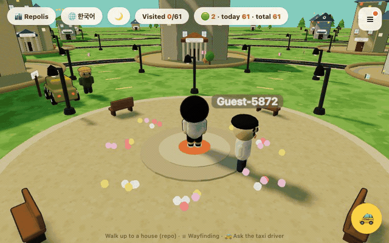
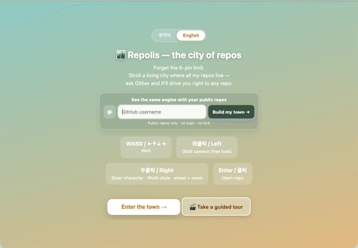

<div align="center">

<a href="https://hyeonsangjeon.github.io/Repolis/"></a>

# Repolis — the City of Repos

[English](README.md) · [한국어](README.ko.md)

**Public GitHub repos become a walkable 3D town. Traffic shapes the buildings, residents live there, and Gitber drives you to the right project.**

[](https://hyeonsangjeon.github.io/Repolis/)
[](https://hyeonsangjeon.github.io/Repolis/?launch=1)
[](https://github.com/new?template_name=Repolis&template_owner=hyeonsangjeon)

<a href="https://hyeonsangjeon.github.io/Repolis/"></a>

<sub>🎬 <strong>15-second demo:</strong> traffic → buildings · ask Gitber → taxi ride → real repo card</sub><br>
<sub><code>WASD</code> / touch to walk · ask Gitber · <code>Enter</code> / tap to open · no sign-up or build · <strong><a href="#run-in-60-seconds">Run locally</a></strong> · ⭐ <strong><a href="https://github.com/hyeonsangjeon/Repolis">Star Repolis</a></strong></sub><br>
<sub>Type any GitHub username on the first screen. Repolis uses public metadata only.</sub>

[](https://github.com/hyeonsangjeon/Repolis/actions/workflows/refresh.yml)
[](https://threejs.org)
[](index.html)
[](LICENSE)

</div>

## What the demo proves

| In the demo | What it means for your repositories |
|---|---|
| traffic, stars, forks, clones, and activity become visible architecture | portfolio signals become a place people can understand without opening a dashboard |
| Gitber searches by natural language, then physically drives to the result | repository discovery becomes an interaction, not another list |
| `?user=<login>` rebuilds the town from any public GitHub account | you can test the same engine with your work before cloning or configuring anything |

**Fastest proof:** open **[Try my GitHub](https://hyeonsangjeon.github.io/Repolis/?launch=1)**, type your login, and walk through your public repos. No token, account connection, or fork is required.

<div align="center">

<a href="https://hyeonsangjeon.github.io/Repolis/?launch=1"></a>

<sub>⌨️ <strong>Username → your own town:</strong> type <code>mrdoob</code> → his 58 public repos stand up as a walkable city</sub>

</div>

If this gives you a useful way to present repositories, **[star Repolis](https://github.com/hyeonsangjeon/Repolis)** — it helps other developers discover the template.

## From preview to your own city

| Goal | What to do | Result |
|---|---|---|
| preview my public repos | use the live username field | a shareable metadata-built town in seconds |
| keep my town on my GitHub profile | click **Put this town on my GitHub profile** when the preview is ready, or use **Town Postcard Studio** | a 600px portal that always opens my personalized town |
| publish my own Repolis | use the template, enable Actions + Pages, run **Refresh Repolis data** once | your fork owner's public repos become the default town; no PAT required |
| grow buildings from real traffic | optionally add the `GH_PAT` Actions secret | daily cumulative views, visitors, and clones enrich the same city |

Forks automatically infer `<owner>.github.io` as the town owner and do **not** call the upstream AI or realtime Workers. Custom domains set one value in [`repolis.config.js`](repolis.config.js).

## How repository data becomes a city

Repolis turns public GitHub metadata and cumulative traffic into a place instead of another dashboard.

| Signal | What it becomes |
|---|---|
| unique visitors | building height |
| forks | lot and building width |
| clones | banners and gold trim |
| views | garden and fence size |
| stars | roof ornaments |
| recent activity | window glow at night |

Repositories are grouped into topic districts with roads, signs, hubs, and a world map. The owner town refreshes daily from committed traffic history plus the GitHub API; `?user=<login>` can build a lighter town from any user's public repositories.
At ordinary walking distances, a one-draw architectural LOD keeps each repo house's textured walls and roof while preserving its plot, hedge, path, real window panes, shutters, sills, flower boxes, gutters, and tier-specific porch, balcony, or portico.

## A village that lives

- **Residents have lives, not idle loops.** Named townspeople wander their districts, keep daily rhythms, carry changing moods, visit cherished haunts, recognize friends, stroll and sit together, gather around the campfire, and sometimes celebrate a recent repository release. Their cottages form **Starlight Row** on the north-east edge, with resident-coloured gardens, three roof silhouettes, shutters, transoms, selected window boxes, canopies, chimneys, and roof finials. A shared flower bed, lanterns, hedges, and broadleaf/cypress trees care for the commons. Night brings residents home to warm windows and porch seats, while morning sends them back to their district work. Pairs also choose their own short **Shared Joy** excursions to real flower patches, visible night stars, or a real repo house—without a player prompt or AI call. Ask a specialist question and they introduce the right scholar instead of pretending to know: follow the compass and find that scholar in the world.
- **Exploration has continuity.** The Explorer Passport records houses and landmarks, district progress shows what remains, and the daily **Village Chronicle** connects one resident to their cherished haunt and a truthful related repo or district.
- **Every repo house opens into one real room.** Its card leads to the reusable **Repository Atelier**: a walkable 3D exhibition whose Repository Core, history/data wall, and action terminals rebind deterministically to that repo. Entering costs no network or AI call; GitHub and Gitber run only when you choose a terminal.
- **Daily refresh now means something on return.** The Passport's **Town Gazette** compares the current public repo snapshot with the last one this browser marked read, then highlights new repos, release tags when available, pushes, and positive metric growth. It is entirely local and costs nothing.
- **Repositories form relationships.** The Stargazer's Observatory finds a truthful three-repo connection from shared topics or languages and draws it as a nighttime Constellation Trail.
- **Quiet maintenance gets its own light.** The Observatory's Maintainers' Night Watch picks three recently tended, low-star repositories from public metadata and asks visitors to light their lanterns—celebrating care, not popularity.
- **Landmarks carry the project story.** The Contribution Library archives papers, talks, open-source work, and awards; Chronopolis hosts the Council of Time; the plaza, observatory, park, and fairground make the city worth walking. At Petite-Venise, a boardable low-profile ferry follows the real canal curve beneath the flower bridges for one scenic town tour.
- **The World Tree anchors the skyline.** It is a deterministic, code-native Three.js sculpture generated through the [threejs-sculpt-dna](https://github.com/hyeonsangjeon/threejs-sculpt-dna) Copilot plugin, with rooted foliage, living motion, and tree-isolated bloom.

## Ask the city

| Guide | What to ask | How it answers |
|---|---|---|
| **Gitber · POLARIS** | “Take me to an AI agent repo” or “most cloned” | local indexed search by default, then drives to the selected house |
| **VEGA · Archivist** | Azure, .NET, Copilot, Microsoft products | grounded Microsoft Learn search with references |
| **RIGEL · Cartographer** | how a public repository works | grounded DeepWiki exploration |
| **MIRA · Timekeeper** | current library APIs and version-specific examples | direct Context7 lookup; roams the Library district |
| **LYRA · Forgemaster** | public models, datasets, and ML papers | direct Hugging Face search; roams the AI district |
| **Council of Time** | a technical trade-off or disputed claim | deterministic curated verdicts, plus optional live debate clearly marked unverified |

The town works without a backend. **Local** search is instant and keyless; **WebLLM** is optional in-browser inference; the live demo adds grounded answers and official public MCP lookups through a Cloudflare Worker. Missing services degrade to Local search or solo play.

## Run in 60 seconds

```bash
git clone https://github.com/hyeonsangjeon/Repolis
cd Repolis
python3 -m http.server 8000
# open http://localhost:8000
```

There is no install or build step. Three.js is loaded from a CDN import map; local data and modules are served as static files.

To rebuild the owner city from GitHub plus collected traffic history:

```bash
gh auth login
GTM_DIR=data python3 scripts/build_repos.py
```

`repos.json` is generated. Change the builder, never the generated JSON by hand.

## Build your own city

The quickest preview needs no fork: open **[Try my GitHub](https://hyeonsangjeon.github.io/Repolis/?launch=1)** or share `https://hyeonsangjeon.github.io/Repolis/?user=<login>`.

For a persistent metadata-built city:

1. Click **[Use this template](https://github.com/new?template_name=Repolis&template_owner=hyeonsangjeon)**.
2. Enable Actions, then enable GitHub Pages from `main` at the repository root.
3. Run **Refresh Repolis data** once; the workflow uses `github.token` to build from the template owner's public repos and continues daily.
4. Optional: add an Actions secret named `GH_PAT` to collect cumulative traffic. Without it, stars, forks, recency, language, topics, and releases still build the city.

Only public repositories are rendered. Untouched mirror forks are filtered out, and private repository names never enter the public data.

## Architecture

```text
traffic history + GitHub API
             │
             ▼
 scripts/build_repos.py ──▶ repos.json
                                │
                                ▼
                    index.html + local modules
                         Three.js town
                         ├─ Local search
                         ├─ optional grounded AI Worker
                         └─ optional realtime Worker
```

Repolis stays a **zero-build static web app**. The main runtime remains in `index.html`; specialized local files hold generated data, the scholar roster, the World Tree factory, and deterministic Council logic.

| Path | Purpose |
|---|---|
| [`index.html`](index.html) | 3D world, UI, navigation, residents, exploration, i18n |
| [`repolis.config.js`](repolis.config.js) | fork owner inference and safe optional-service defaults |
| [`repos.json`](repos.json) | generated repository and traffic data |
| [`scholars.js`](scholars.js) | scholar roster |
| [`assets/world-tree/`](assets/world-tree/) | procedural World Tree factory |
| [`cloudflare-taxi/`](cloudflare-taxi/) | grounded AI and optional resident dialogue Worker |
| [`cloudflare/`](cloudflare/) | realtime presence Worker |
| [`council/`](council/) | deterministic Council engine and guards |
| [`scripts/`](scripts/) | data builders and regression checks |

## Optional services

| Capability | Setup |
|---|---|
| Grounded taxi and scholars | [`cloudflare-taxi/README.md`](cloudflare-taxi/README.md) |
| Realtime visitors and counters | [`cloudflare/README.md`](cloudflare/README.md) |
| Vercel taxi alternatives | [`api/`](api/) and [`.env.example`](.env.example) |
| Copy-paste integrations | [`examples/`](examples/) |

## Controls

| Input | Action |
|---|---|
| `W A S D`, arrows, or left touch stick | walk |
| mouse drag or right touch stick | look and turn |
| wheel | zoom |
| `Enter`, click, or the mobile door button | open the nearby place |
| taxi button | ask Gitber |
| menu / map / passport buttons | navigate and track exploration |
| language and sun/moon buttons | switch language and time of day |

## Documentation

- [`AGENTS.md`](AGENTS.md) — contributor and agent operating contract
- [`docs/domain-model.md`](docs/domain-model.md) — repository data and feature model
- [`docs/known-limitations.md`](docs/known-limitations.md) — intentional constraints
- [`SCHOLARS.md`](SCHOLARS.md) — scholar roster and grounding roles
- [`COUNCIL_PATTERN.md`](COUNCIL_PATTERN.md) — the debate-to-judge pattern
- [`CHANGELOG.md`](CHANGELOG.md) — recent releases and archive links
- [`repolis.yaml`](repolis.yaml) / [`llms.txt`](llms.txt) — machine-readable project entry points

## License

MIT © [Hyeonsang Jeon](https://github.com/hyeonsangjeon). Data collection credit: [github-traffic-monitor](https://github.com/hyeonsangjeon/github-traffic-monitor).
